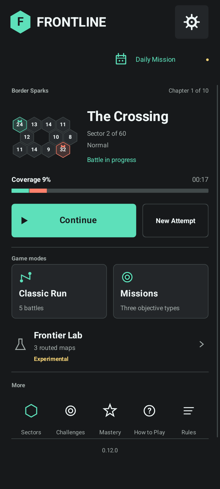
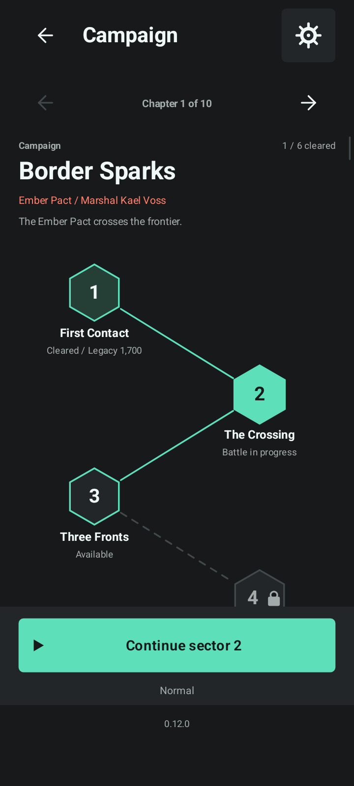
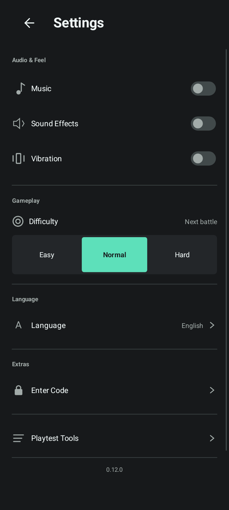

# Frontline

An original offline Android territory-conquest game. **V12 step 2 / 0.12.2** polishes the dark Command Deck, compact vertical campaign trail and full-page settings, while retaining the opt-in local playtest additions from 0.12.1. It retains 60 campaign sectors across ten story chapters, up to five computer opponents, nine objective missions, an offline daily mission, five-battle Classic runs and three experimental routed maps. Difficulty-specific records, mastery rewards, music, practical tutorials and saved battles remain unchanged. English, Bahasa Indonesia and Hindi are bundled offline. No login, backend, network permission, ads or remote telemetry.

Current source version: `0.12.2` (version code `14`).

**Unverified source update:** 0.12.1 and 0.12.2 are code-only pushes. No tests, compilation, APK build or screenshot capture were performed for this step, at the user's request. The latest verified local V12 APK and screenshots remain 0.12.0; they do not demonstrate the current UI.

## Install

Android 7.0 or newer is required. The last verified local V12 build is **0.12.0**, `build/FrontlineV12.apk`; it has not been replaced for 0.12.1 or 0.12.2. The build script will produce `build/Frontline-debug.apk` when a build is separately authorized. There is no APK for the current source update and no new GitHub release. The [historical V11 test release](https://github.com/rohitashmathur/Frontline/releases/tag/v0.11.0) remains available. This is a prototype, not a Play Store release.

For an existing debug build signed with the original prototype key, install over V7, V6 or V5 to retain local progress; do not uninstall first. Package identity is unchanged. Legacy scores have unknown attempt difficulty; the current Campaign UI labels old scores as previous-rules records rather than comparable current bests. Existing overfilled V5 garrisons are clamped to the 100/125 limits, while armies already in flight retain their units.

## V12 Step 2

- Charcoal/mint Command Deck with the actual retained battle preview, coverage/time, primary Continue and secondary New Attempt. A fresh game shows its real three-star target instead of fabricated battle metrics.
- Settings gear remains top-right. A full-width Daily card immediately below it shows Available/Completed and the UTC reset countdown. Home refreshes that countdown at minute boundaries without a continuous animation loop.
- Classic Run shows the current battle and retries on separate lines, or the factual cleared count from the last finished run. Missions, Frontier Lab and icon shortcuts preserve their existing flows.
- A ten-chapter campaign ribbon shows actual earned clears and best total; unlocking with the V7 code does not fill it. Tapping it opens Campaign.
- Six compact vertical sector rows per chapter show selected, cleared and locked states. Selection stays on the trail; its Play/Continue action is separate. All ten chapters remain browsable. Previous-rule scores are explicitly labelled.
- Full-page grouped settings: audio/haptics, next-battle difficulty, expandable language picker, Enter Code and collapsed Playtest Tools. Returning from settings preserves the originating screen.
- Expanded Playtest Tools show entry usage even with logging off, warn at 450 of 500 entries and explain oldest-event replacement at 500. Manual export/clear and the existing storage bound are unchanged.
- The inactive Home map preview is cached by selected sector and difficulty; repeated redraws do not reconstruct its simulation. Small preview crowns scale with the map.
- Scrolling and localized accessibility labels remain in place. Current layout, touch sizes and countdown lifecycle behavior still require verification.
- The footer on Home, Campaign and Settings is `0.12.2`. Battle rules, save formats, progression and exact V7 `12345` behavior are unchanged.

The 0.12.1 local measurement work is retained: build/attempt context, Home navigation and language changes, first actual dispatch timing, Run milestones, refused Logistics routes and optional post-battle difficulty feedback. Logging remains opt-in and local. A missing checked-exception declaration in its test source is fixed; that fix has not been compiled here.

See [Step 2 release notes](docs/release-v12-step2.md) and [pending verification](docs/verification-v12-step2.md). [Step 1 verification](docs/verification-v12.md) is historical 0.12.0 evidence only. Daily streaks are deferred until rule-version semantics are agreed. Development stops after this step's commit and push; further work requires approval.

## V11 Changes (Preserved)

- New Classic battles start every faction with the same army. Existing saved armies are not rewritten.
- Settings is a generously sized, accessible gear in the top-right safe area. Daily Mission sits immediately below it, with a separate touch target and completion state.
- Settings switches English, Bahasa Indonesia and Hindi immediately without changing a battle, difficulty, Daily seed or progress. The choice persists. Existing installations default to English; new installations use a supported device language.
- Tutorial Skip and Complete are mutually exclusive and protected against duplicate input. Corrected terminal-event semantics start with V11; historical logs are retained unchanged.
- Missions and Daily use objective-specific completion and records: elapsed completion time for Hold King, completion-only for Keep King, and fewest troops deployed for Troop Budget, with time only breaking budget ties. Revised missions award no campaign speed stars. V10 records remain historical.
- The model stores a defeat reason. Budget missions show used/remaining troops and warn before an excessive deployment; friendly reinforcement counts toward the allowance. Over-budget actions still lose rather than being silently cancelled.
- Mission configurations, Daily generation and record evaluation are versioned. Continuing an older battle keeps its configuration, timers, difficulty and date.
- Classic Run Mode has five curated battles, four councils, five exact non-stacking perks and one same-seed retry. Its frozen save, factual results and perks are isolated from campaign/mastery. Restarting a run battle counts as defeat.
- The small [Balance Lab](tools/BALANCE_LAB.md) records matched seeds, actual-model controller/seat comparisons, durations and unresolved timeouts. The [human playtest checklist](docs/playtest-v11.md) remains pending execution.
- Experimental Logistics has three separate routed maps, friendly paths around gaps, legal-target/path/ETA previews, transit combat and isolated records. Classic campaign and Run targeting are unchanged; no distance attrition is added.

See [V11 Rules](docs/game-rules-v11.md) and the versioned verification reports for precise scope and remaining human-playtest work.

## V10 Changes (Historical)

- Continue Battle is the primary action for an unfinished attempt. New Attempt opens a briefing; replacing or restarting an active battle requires confirmation. Selecting a sector does not discard it.
- Practical capture, reinforcement, deployment and king-control tutorial steps, replay/skip, optional advanced Rules, and opening-sector tactical prompts.
- Sent/remaining troop previews, MAX labels, actual capture/interception/king/cap-loss feedback, distinct faction symbols and first-large-map camera guidance.
- Pre-run star targets, actual time versus target, best-time improvement, records by attempt difficulty, and one factual result insight. Settings difficulty applies to the next attempt.
- Opt-in local playtest logging, bounded to 500 events, with manual CSV export through Android's document picker. Pauses are not abandonments.
- Separate configurable hold-king, retain-starting-king and deployment-budget objectives. Nine curated missions; campaign unlocks remain independent.
- Pressure and Guardian AI styles change targeting, reserves and coordination, not production rates. Old saved battles retain the classic AI.
- Daily missions reset at 00:00 UTC, use a date/version seed and fixed Normal difficulty, and retain their original identity across midnight and process restarts. Local daily bests retain the latest 60 dates.
- Three measurable mastery badges and earned Signal/Blueprint visual themes. Cosmetics do not change combat rules or faction colours.

V10 scope was A1-A6 and B1-B4 from the previous priorities. Its reports are historical evidence, not verification of V11. Difficulty, language quality and replay interest are not claimed to be human-validated.

## V7 Changes

Settings now includes **Enter Code**. Enter exactly `12345` and select Unlock (or the keyboard's Done action) to unlock every sector. Empty or incorrect codes show an inline error and change nothing; Cancel leaves progression unchanged. Unlocking persists locally, preserves existing scores/preferences/saved battles, and does not mark unplayed sectors as cleared. The shortcut is available from both main-menu and battle Settings; it is not a security or authentication feature.

## V6 Changes

- Five-step How to Play includes an interactive Capture King/Lose King booster demo, previous-step navigation and tappable 25%/50%/100% deployment examples.
- A compact boost strip remains visible above the battlefield; king changes update and pulse it without moving the board.
- Held enemy king bonuses: 1 = 1.2x, 2 = 1.44x, 3 = 1.728x, 4 = 3x, 5 = 3.6x. Your original king is excluded. Bonuses apply team-wide only while held.
- Thirty new sectors, five new chapters, Iron Dominion and Frost Union factions, and larger battlefields with zoom, pan, pinch and fit controls.
- Normal/Hard opponents prioritize recovering their original king, including coordinated attacks, while keeping defensive reserves.
- Fixed maximum garrisons: ordinary 100, king 125. Team saturation no longer enables overflow growth. Reinforcements respect the same caps.
- Above 90% player coverage for ten sustained simulation seconds, hopeless rivals can resign after a conservative check of all remaining garrisons and convoys. Their tiles become yours; a rival with a recovery opportunity continues fighting.
- A thicker coverage bar with whole-number team percentages, no decimals, and 100% shown at full control.

## Documentation

- [Application Architecture and Flow Diagrams](docs/architecture.md)
- [V12 Step 2 Release / Current Source](docs/release-v12-step2.md)
- [V12 Step 2 Pending Verification](docs/verification-v12-step2.md)
- [V12 Step 1 Release](docs/release-v12.md)
- [V12 Step 1 Verification](docs/verification-v12.md)
- [Current V11 Rules](docs/game-rules-v11.md)
- [V11 Phase 1 Verification](docs/verification-v11-phase1.md)
- [V11 Balance Lab Verification](docs/verification-v11-phase2.md)
- [V11 Run Mode Verification](docs/verification-v11-phase3.md)
- [V11 Logistics Verification](docs/verification-v11-phase4.md)
- [V11 Delivery Report](docs/verification-v11.md)
- [V10 Game Logic and Preserved Balance Rules](docs/game-rules-v10.md)
- [V10 Acceptance and Verification](docs/verification-v10.md)
- [Native Android Screenshots](docs/screenshots.md)

Historical **0.12.0** native screenshots below. No 0.12.1 or 0.12.2 captures have been produced.

  

## Play

Drag from a green tile to attack or reinforce another tile. Choose 25%, 50% or 100% deployment. King tiles grow faster; captured enemy kings boost your team's production. Hostile armies meeting in flight cancel one-for-one, while friendly armies pass through. Eliminate every rival territory/army or force hopeless rivals to resign.

On large maps, +/- changes zoom and the fit icon restores the whole board. Two-finger pinch/drag pans and zooms; when zoomed, dragging from a neutral/enemy/empty area pans instead of deploying. One-finger drags starting on your own tile still send troops. Long-press tool icons for their names.

Use the main menu to continue, select a sector, start a new attempt, choose a mission, review mastery or change settings. Scores, stars, best times, unlocks, settings and unfinished battles are saved locally. Campaign wins unlock the next sector; mission wins do not. Pause/Main Menu retains the round; replacing an unfinished attempt requires confirmation. Uninstalling or clearing app data removes saves.

## Repository Layout

| Path | Purpose |
| --- | --- |
| `app/` and root Gradle files | Native Android app, campaign, portable battle rules and assets |
| `scripts/` | Windows setup, build and Android/portable verification |
| `tests/` | Core, legacy regression, V10/V11 features and V12 screen tests |
| `android-tests/` | Separate test-only native flow and multi-touch instrumentation |
| `tools/` | Rendering adapters, deterministic test saves and original music generation |
| `docs/` | Architecture, diagrams, versioned rules, acceptance and native screenshots |
| `ios/` | Future iOS placeholder; not implemented |
| `backend/` | Future optional service placeholder; not implemented |

The working Android project stays at the root of this monorepo. Assets, campaign content and specifications can inform an iOS port, but native Java does not directly build for iOS. The offline game does not require a backend. No open-source license has been added.

## Build on Windows

Run PowerShell from the repository root:

```powershell
# Review Google's Android SDK terms before using the acceptance switch.
powershell -NoProfile -ExecutionPolicy Bypass -File .\scripts\setup-android.ps1 -AcceptSdkLicense
powershell -NoProfile -ExecutionPolicy Bypass -File .\scripts\test.ps1
powershell -NoProfile -ExecutionPolicy Bypass -File .\scripts\build-android.ps1
```

Setup downloads a checksummed Temurin Java 17 runtime and Google's Android SDK tools into `.toolchain/`, without changing global environment variables. The local build compiles Java, generates the original 20-second WAV loop, packages resources/DEX, aligns and signs the APK, and verifies its signature.

Alternatively, open the Gradle project in Android Studio using Java 17, Android SDK 35 and Gradle 8.11.1. The PowerShell build does not require Android Studio or Gradle.

**Signing:** SDKs, signing keys, credentials and generated packages are excluded from Git. Back up the original prototype debug key privately. A fresh clone creates a different debug key, so its APK cannot update an installation signed by the original key. Publication needs a separately managed release key; never commit it.

## Verification

**Current source is unverified.** The commands below are for a future, separately authorized verification run, not results for 0.12.2. Updated checks have been added but not executed. Historical assertion totals, APK checksums and screenshots remain in their original versioned reports.

The portable suite is designed to cover all 60 maps on all three difficulties, dispatch, production/caps, capture/reinforcement, swept interception, packet accounting, corruption recovery, V4/V5 migration, six-team saves, held-king milestones, guarded resignation, AI reserves/recovery/coordination, progression, tutorial and camera input. Java2D renders the same scene commands at compact, tall and tablet sizes and checks text bounds. Current release metadata is checked against AppVersion, both build paths and designated current-document metadata; historical reports are intentionally excluded.

```powershell
powershell -NoProfile -ExecutionPolicy Bypass -File .\scripts\setup-emulator.ps1
powershell -NoProfile -ExecutionPolicy Bypass -File .\scripts\start-test-device.ps1
powershell -NoProfile -ExecutionPolicy Bypass -File .\scripts\test-unlock-code.ps1
powershell -NoProfile -ExecutionPolicy Bypass -File .\scripts\test-android-gestures.ps1
powershell -NoProfile -ExecutionPolicy Bypass -File .\scripts\test-android-v10.ps1
powershell -NoProfile -ExecutionPolicy Bypass -File .\scripts\test-android-v11.ps1
powershell -NoProfile -ExecutionPolicy Bypass -File .\scripts\test-android-v11-run.ps1
powershell -NoProfile -ExecutionPolicy Bypass -File .\scripts\test-android-v11-logistics.ps1 -RunDevice
powershell -NoProfile -ExecutionPolicy Bypass -File .\scripts\test-android-v12.ps1
```

The native scripts target Android 15 and only the named `emulator-5580`; test fixtures never target a physical phone. Put the actual previous `FrontlineV6.apk` in `build/` for the upgrade check. The separate test-only instrumentation package exercises real Android touch/lifecycle flows and captures Canvas pixels, then is removed. The V12 harness includes four display configurations, with the app retaining portrait orientation; it has not run against 0.12.2. Captures go to `build/device/`; fixtures/tools are not packaged in the game APK. `device-smoke-test.ps1` is the historical V6 flow script, not the V10 acceptance runner. Stop the emulator after use.

For V7's code dialog and real V6 upgrade check, run `scripts/test-unlock-code.ps1` after starting the dedicated emulator. Keep the actual V6 APK at `build/FrontlineV6.apk`. The test uses real native input, verifies wrong/empty/cancelled codes, confirms saved data is unchanged apart from unlocks, restarts the app, and selects/plays Sector 60. It also checks the dialog on a small phone viewport.

See [V7 Verification Results](docs/verification-v7.md) for that historical APK's checksum and results. The earlier [V6 Verification Results](docs/verification-v6.md) also remain historical.

## Prototype Limits

- AI uses heuristics. Pressure and Guardian have different targeting/reserve behaviour, but no faction-specific production bonuses.
- Later-map balance and resignation feel still need human playtesting.
- Classic campaign and Run troops fly directly without terrain obstruction. Experimental Logistics alone uses friendly connected routes.
- Menu controls expose localized accessibility labels. Full nonvisual battlefield play still needs accessibility testing.
- Difficulty is fixed per attempt; Settings selects the next attempt's difficulty. Records are local, not competitive rankings.
- Headless tests verify music playback state, not perceived loudness or manufacturer-specific audio/touch behavior.
- This is a debug prototype, not a Play Store release.
