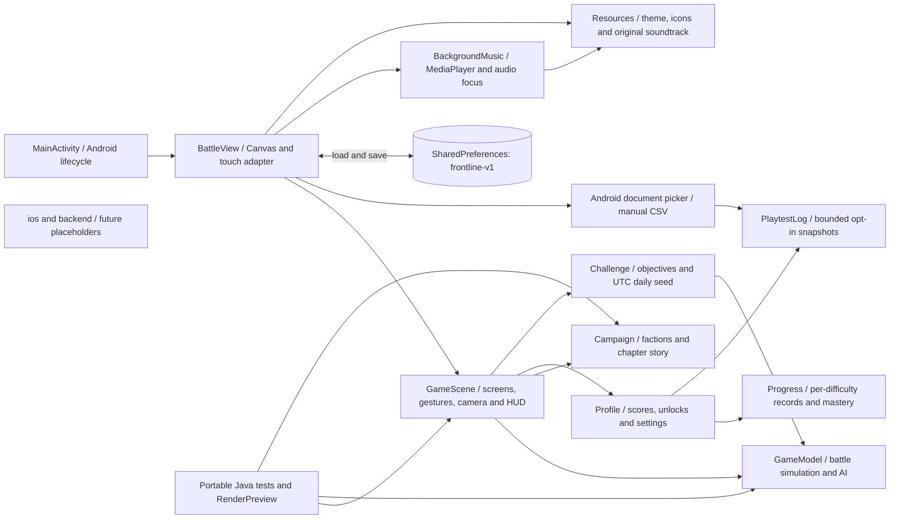
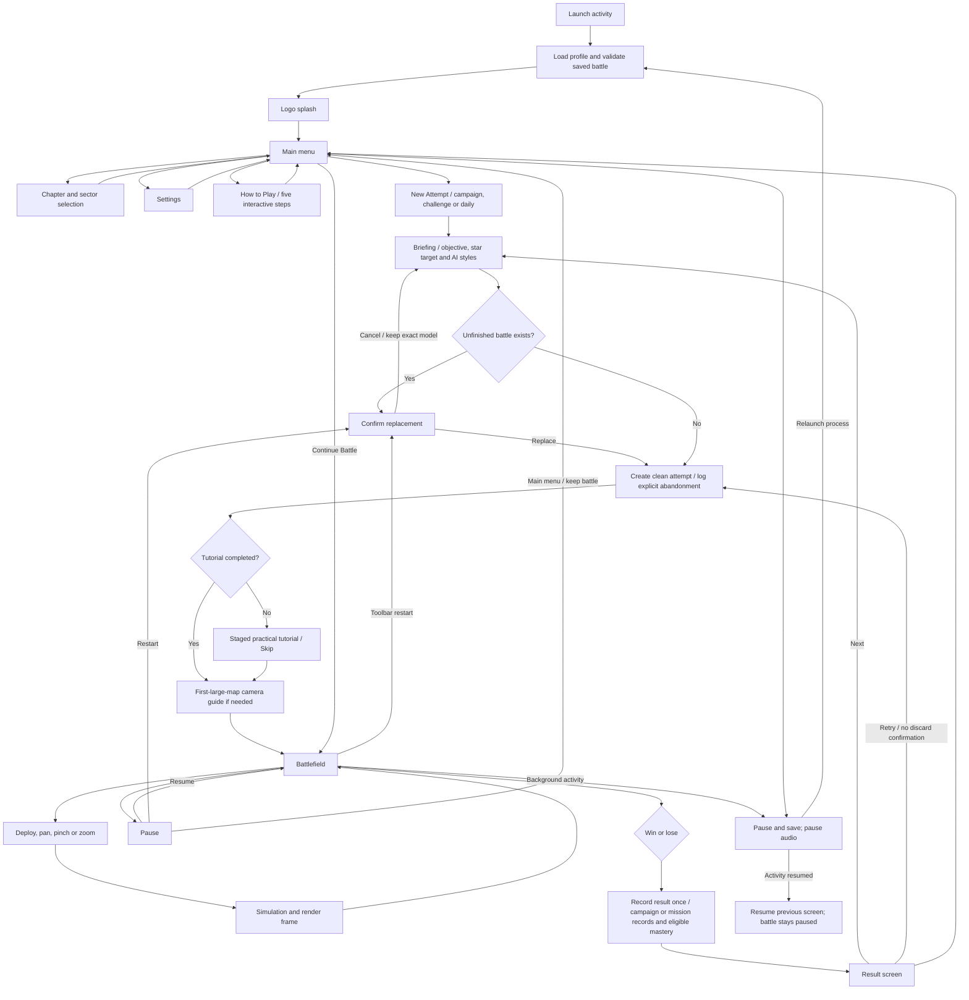
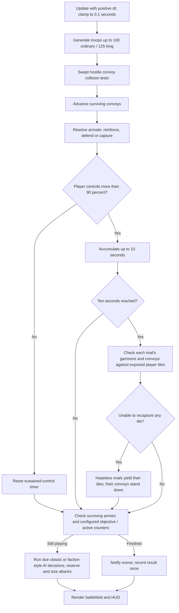

# Frontline Architecture (V10)

Frontline 0.10.0 is an offline, single-activity Android game. The production app is native Java and Android Canvas; simulation, scene, progress, challenge selection and measurement also run without Android for regression tests. There is no server, login, network permission, advertising, remote telemetry or cloud save. Local measurement is explicit opt-in.

## Components

| Component | Responsibility | Source |
| --- | --- | --- |
| Android adapter | Lifecycle, safe-area layout, Canvas, one/two-finger input, audio/haptics, storage, native code dialog and manual document export | `app/src/main/java/com/frontline/offline/MainActivity.java` |
| Scene controller | Protected attempt flow, practical tutorial, campaign/missions/daily/mastery/help screens, results, camera and event-based HUD | `GameScene.java` |
| Rules | Generation/caps, dispatch/interception/arrivals, objective counters, AI styles, resignation, history/events and exact binary saves | `GameModel.java` |
| Challenge catalogue | Nine validated objective presets, configurable objectives, deterministic UTC date/version seeds and reset countdown | `Challenge.java` |
| New progress | Difficulty-specific campaign/challenge records, bounded daily bests, mastery progress/awards and cosmetic selection | `Progress.java` |
| Local measurement | Opt-in bounded event snapshots, checksummed persistence and escaped CSV, no Android/network dependency | `PlaytestLog.java` |
| Campaign | Ten story chapters, six named factions, rulers and short HUD names | `Campaign.java` |
| Audio | Default-on looping music, independent enable flag, lifecycle pause/resume, Android audio focus | `BackgroundMusic.java` |
| Test adapters | Java2D rendering, rule tests, Android fixture generation and preference probes | `tests/`, `tools/`, `scripts/` |

`GameModel.LEVELS` holds the 60 map definitions. Owner IDs are local team slots (player 0; rivals 1-5), while a level maps each slot to a persistent faction ID and colour. Original king ownership is derived from the unchanged initial map setup, not current control. This keeps king bonuses deterministic across saves and faction reorderings.

## Application Flow

The tutorial's practice state cannot modify a retained battle. Screens outside the battlefield freeze simulation. Camera gestures cancel troop drags and do not change troop ownership, counts, elapsed time or scoring. Settings difficulty is next-attempt only. Selection is independent of an active attempt; confirmation is required only for actual replacement. Cancel restores the previous paused screen/model, not a newly generated map.

## Simulation Flow

Collision tests use relative motion over the tick, not a single rendered position. Hostile units cancel one-for-one only when they physically meet at the same time. Friendly convoys pass through. Packets preserve unit counts within the 900-particle visual budget. Actual arrivals, interceptions and transfers emit bounded aggregated events; the scene drains those for HUD feedback and king logs. Historical counters persist; transient effects are not replayed on restore.

## Persistence and Migration

- SharedPreferences `frontline-v1` retains all historical `best-N`, `stars-N`, `time-N`, unlocks, sector selection, wins, preferences and tutorial completion. These historical records remain Legacy.
- New Base64 keys `progress-v10` and `playtest-v10` store independently checksummed/validated records, awards/themes and opt-in bounded logs. `camera-guide-seen` is independent of tutorial completion. A corrupt new component is reset alone, not the legacy profile or other components.
- Save on menu/settings actions, activity backgrounding and approximately every 15 seconds of drawing. Only the battle model is persisted; camera position resets to a fitted board.
- V10 writes `FL04`: all prior battle data plus original seed/known-history flags, starting-king loss, rules/AI version, factual interception/cap counters, objective configuration/progress, challenge identity/original daily date and exact RNG state.
- `FL01` (V4-compatible), `FL02` (V5 extended armies) and `FL03` (V6/V7 six-team and resignation state) still load. Old battles use classic AI and unknown seed/history; no difficulty-specific record or clean-king badge is invented. Existing over-cap V5 garrisons clamp to 100/125; already-sent packets retain their units.
- V5 campaign completion unlocks Sector 31. Existing scores, stars, best times, preferences and sector selection remain intact. A corrupt battle is discarded without clearing the profile.
- New saves validate size, values, owner IDs, map size, convoy limits, objective/history consistency, timers, dates and resignation state. Exact RNG persistence keeps subsequent AI/setup randomness consistent across V10 save/resume. All restored states open the menu rather than auto-running.
- The daily attempt's original date/configuration remains in its battle save. Current date changes only the next daily selection. The latest 60 daily records and 500 log entries bound local storage.
- Manual CSV export uses `ACTION_CREATE_DOCUMENT`, writes only to the chosen URI and needs no storage/network permission. Cancelling the picker changes no gameplay data.

## Build and Platform Boundaries

The PowerShell build compiles Java, generates the original WAV loop, packages resources, produces DEX, aligns and signs the APK, then verifies the signature. Test tools and fixtures are not included in the APK. `.toolchain/`, generated `build/`, signing keys and credentials are ignored by Git.

`android-tests/` is a separate, test-only instrumentation package. It exercises real Android multi-pointer events against the production BattleView and captures native Canvas pixels at three viewport sizes. Its APK is never part of the game's distribution.

`app/` and root Gradle files contain Android. `ios/` and `backend/` are reserved, unimplemented folders in this monorepo. An iOS port can reuse assets, campaign content and specifications, but native Java does not directly compile for iOS. Future online services must be optional so offline play remains available.

For gameplay details, see [V10 Rules](game-rules-v10.md), [V10 Acceptance](verification-v10.md) and [Screenshots](screenshots.md).
