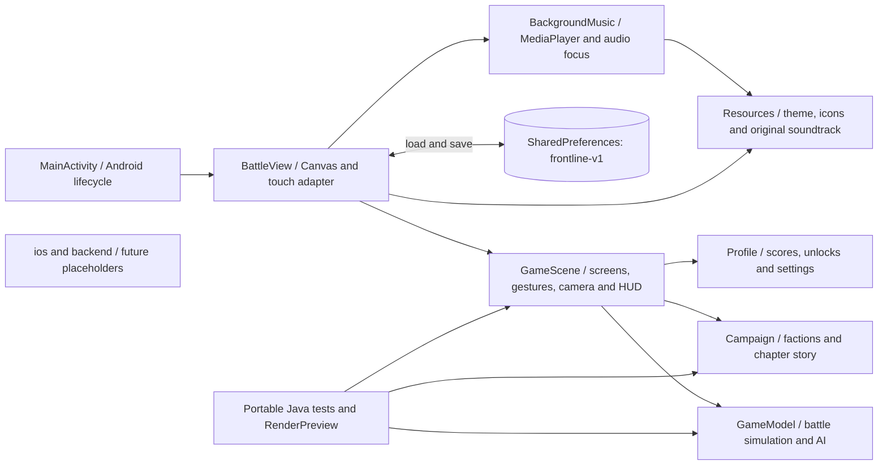
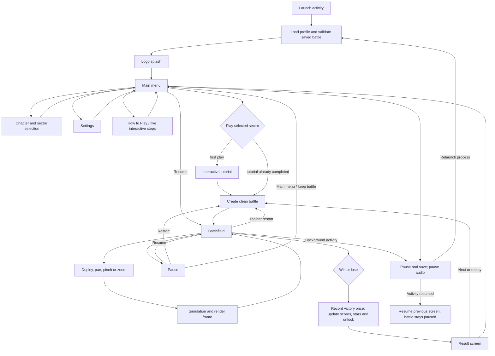
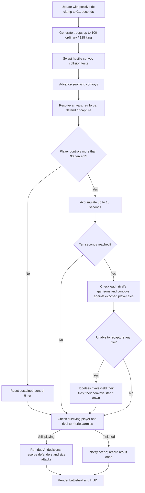

# Frontline Architecture (V6)

Frontline 0.6.0 is an offline, single-activity Android game. The production app is native Java and Android Canvas; the rules and scene controller also run without Android for regression tests. There is no server, login, network permission, advertising, telemetry, or cloud save.

## Components

| Component | Responsibility | Source |
| --- | --- | --- |
| Android adapter | Activity lifecycle, safe-area layout, Canvas drawing, one/two-finger input, haptics, short tones, storage | `app/src/main/java/com/frontline/offline/MainActivity.java` |
| Scene controller | Splash, menu, five-step tutorial, chapter/sector selection, settings, pause/results, camera, persistent boost HUD | `GameScene.java` |
| Rules | Ownership, generation, finite caps, troop dispatch, swept interception, arrivals, AI, resignation, outcomes, binary saves | `GameModel.java` |
| Campaign | Ten story chapters, six named factions, rulers and short HUD names | `Campaign.java` |
| Audio | Default-on looping music, independent enable flag, lifecycle pause/resume, Android audio focus | `BackgroundMusic.java` |
| Test adapters | Java2D rendering, rule tests, Android fixture generation and preference probes | `tests/`, `tools/`, `scripts/` |

`GameModel.LEVELS` holds the 60 map definitions. Owner IDs are local team slots (player 0; rivals 1-5), while a level maps each slot to a persistent faction ID and colour. Original king ownership is derived from the unchanged initial map setup, not current control. This keeps king bonuses deterministic across saves and faction reorderings.

## Application Flow

The tutorial's practice swipes, deployment selectors and king-boost demo use separate local demo state; they cannot change a retained battle. Screens outside the battlefield freeze simulation. Camera gestures cancel troop drags and do not change troop ownership, counts, elapsed time or scoring.

## Simulation Flow

Collision tests use relative motion over the tick, not a single rendered position. Hostile units cancel one-for-one only when they physically meet at the same time. Friendly convoys pass through each other. Packets preserve unit counts within the 900-particle visual budget.

## Persistence and Migration

- Android SharedPreferences stores `best-N`, `stars-N`, `time-N`, `unlocked`, selected sector, wins, difficulty, tutorial completion, music/sound/haptics and a Base64 binary battle.
- Save on menu/settings actions, activity backgrounding and approximately every 15 seconds of drawing. Only the battle model is persisted; camera position resets to a fitted board.
- V6 writes binary magic `FL03`: map/difficulty, round statistics, territory ownership/counts, convoy counts/timing, six AI timers, sustained-control time and resignation flags.
- `FL01` (V4-compatible) and `FL02` (V5 extended armies) still load for the original 30 map indexes. Existing garrisons are clamped to 100/125 on migration. Already-sent army packets retain their units, with the new cap applied on arrival.
- V5 campaign completion unlocks Sector 31. Existing scores, stars, best times, preferences and sector selection remain intact. A corrupt battle is discarded without clearing the profile.
- New saves validate size, values, owner IDs, map size, convoy limits, durations and resignation consistency. Completed or paused states restore to the main menu, not an automatically running battle.

## Build and Platform Boundaries

The PowerShell build compiles Java, generates the original WAV loop, packages resources, produces DEX, aligns and signs the APK, then verifies the signature. Test tools and fixtures are not included in the APK. `.toolchain/`, generated `build/`, signing keys and credentials are ignored by Git.

`android-tests/` is a separate, test-only instrumentation package. It exercises real Android multi-pointer events against the production BattleView and captures native Canvas pixels at three viewport sizes. Its APK is never part of the game's distribution.

`app/` and root Gradle files contain Android. `ios/` and `backend/` are reserved, unimplemented folders in this monorepo. An iOS port can reuse assets, campaign content and specifications, but native Java does not directly compile for iOS. Future online services must be optional so offline play remains available.

For gameplay details, see [V6 Rules](game-rules-v6.md). For actual native captures, see [Screenshots](screenshots.md).
