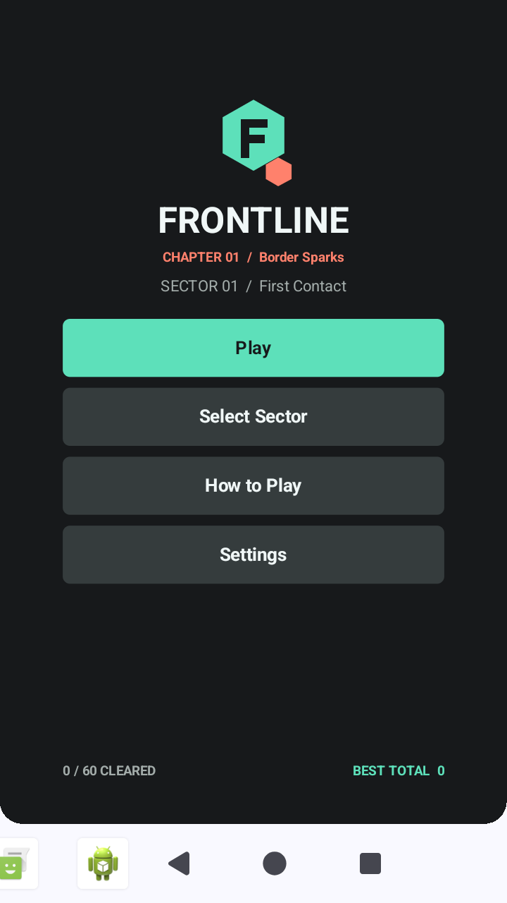
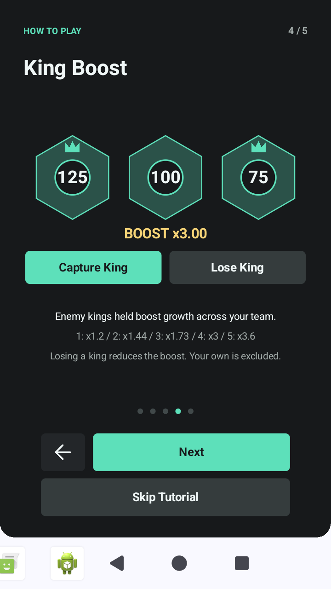
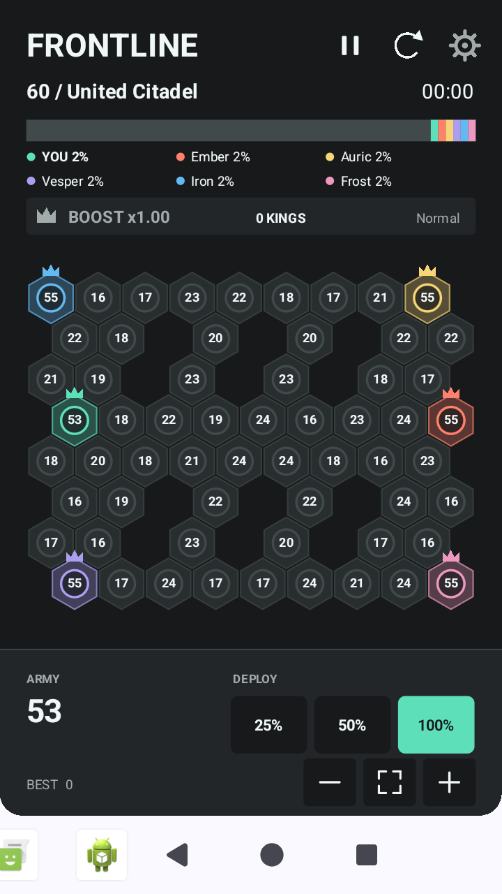
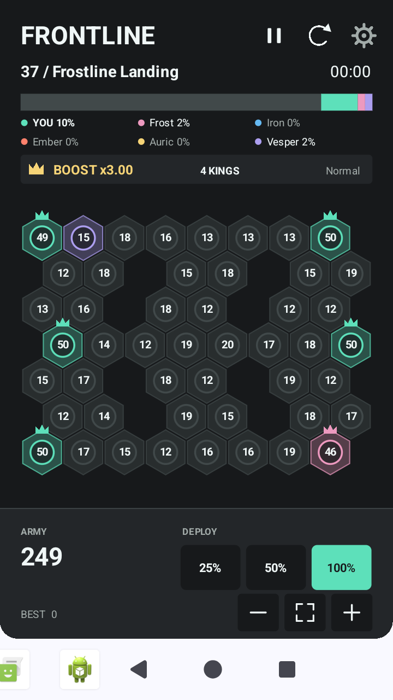
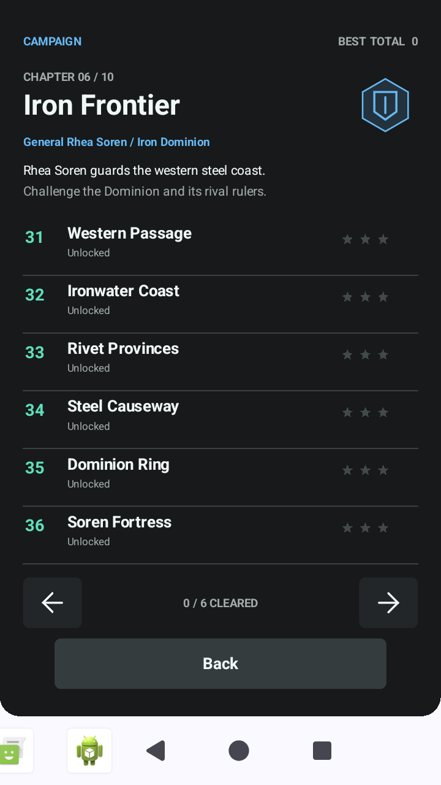
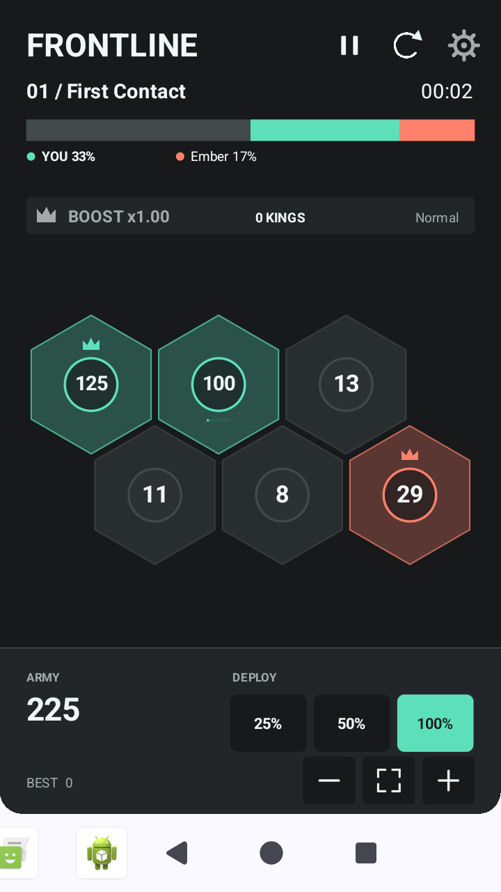
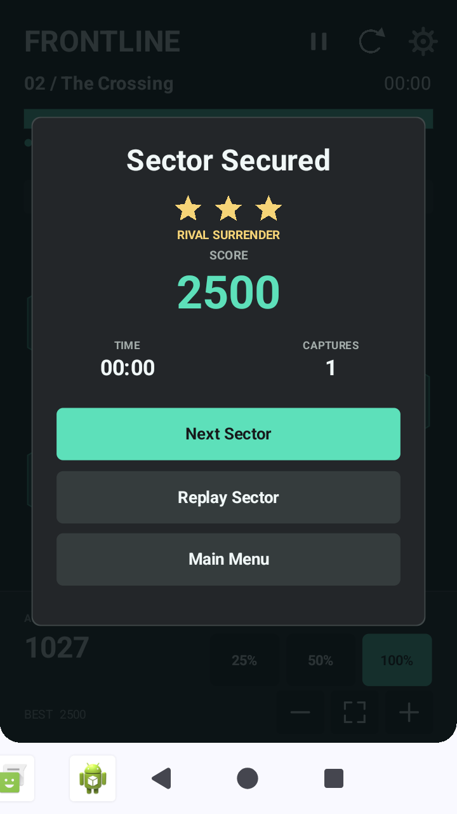
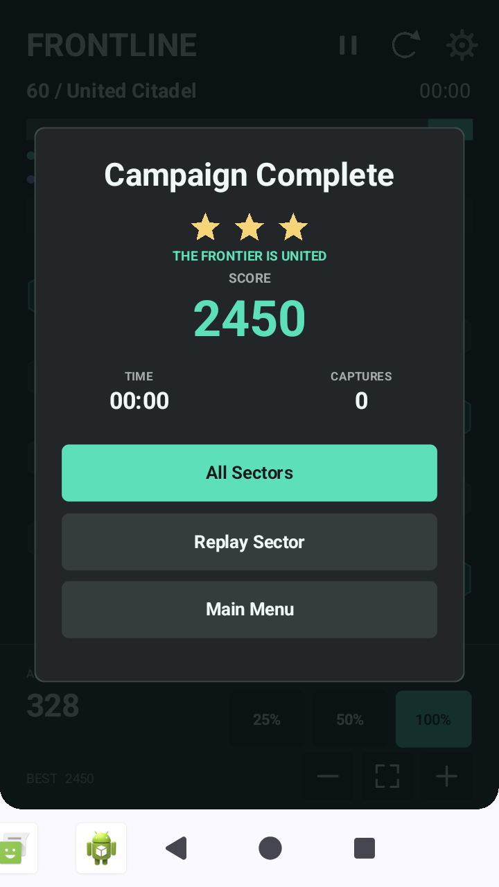
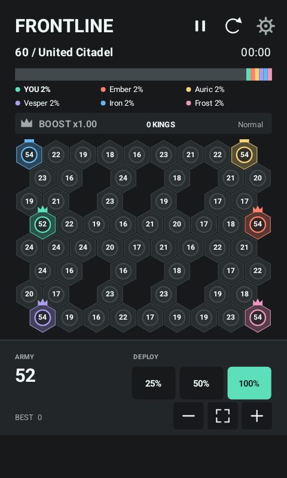
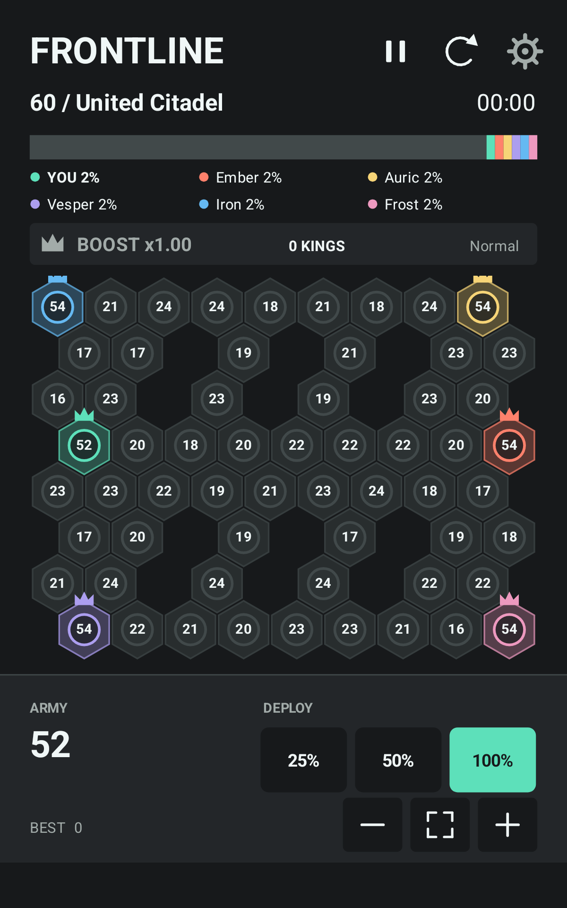

# V6 Screenshots

These are actual Android Canvas captures from the Android 15 test emulator, not UI mockups. Most are 720x1280; the small-phone and tablet captures use their labelled viewport sizes. Boost, cap, surrender and campaign-ending captures use deterministic test saves to make the states reproducible.

| Main Menu | Booster Tutorial |
| --- | --- |
|  |  |

| Five Opponents | Persistent Four-King Bonus |
| --- | --- |
|  |  |

| New Story Chapter | Finite Troop Caps |
| --- | --- |
|  |  |

| Rival Surrender | Campaign Complete |
| --- | --- |
|  |  |

| Small Phone (480x800) | Tablet (1200x1920) |
| --- | --- |
|  |  |

Run `scripts/test.ps1` for portable render previews, then `scripts/setup-emulator.ps1`, `scripts/start-test-device.ps1` and `scripts/device-smoke-test.ps1` for native captures under `build/device/`. The smoke test only uses and clears the named `emulator-5580` test device, never a connected physical phone.
