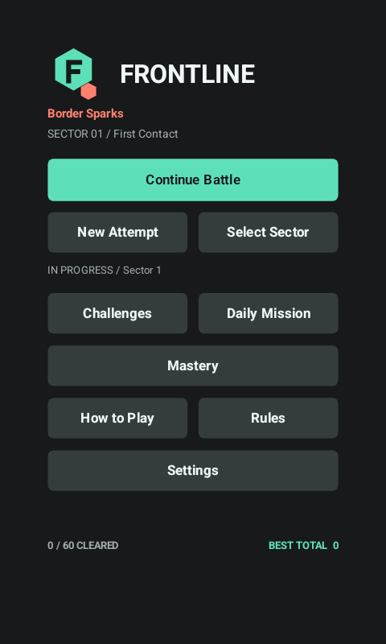
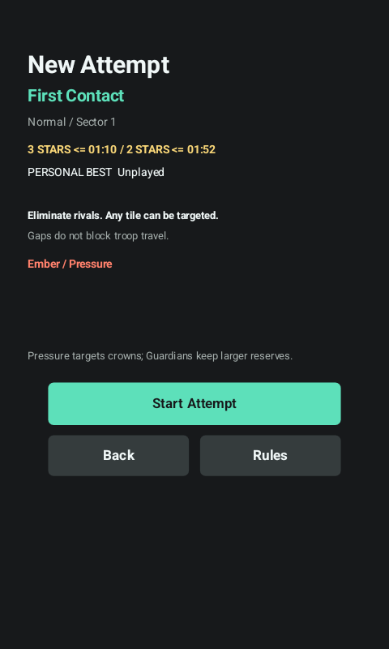
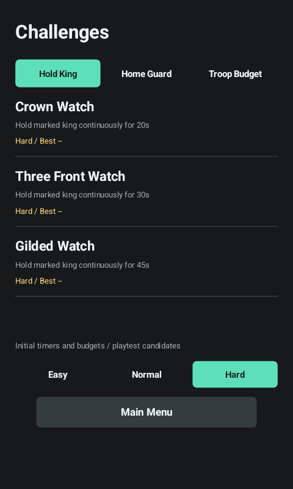
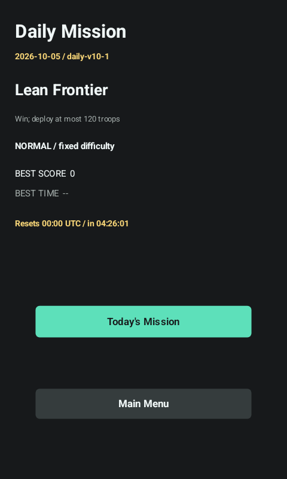
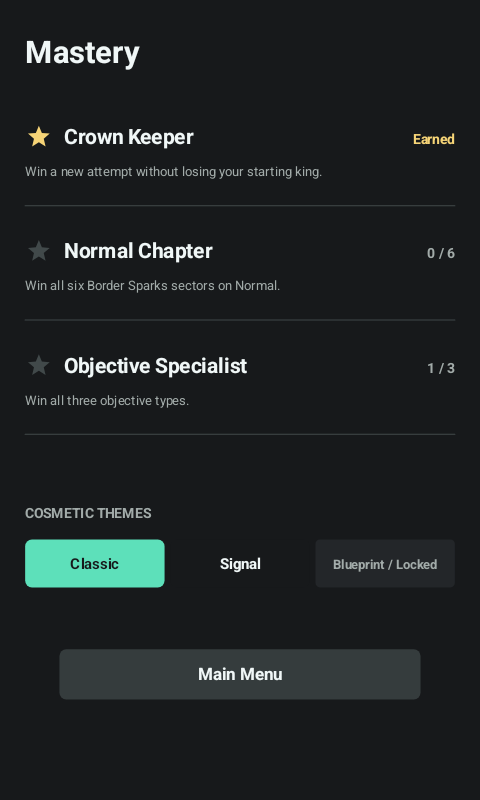
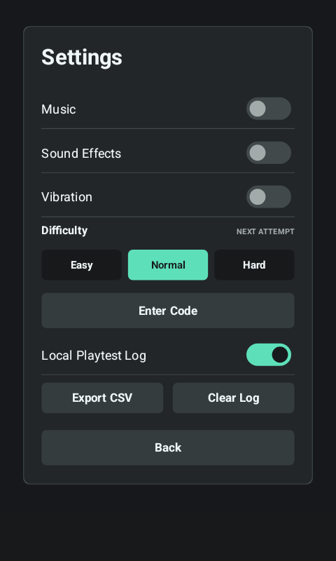
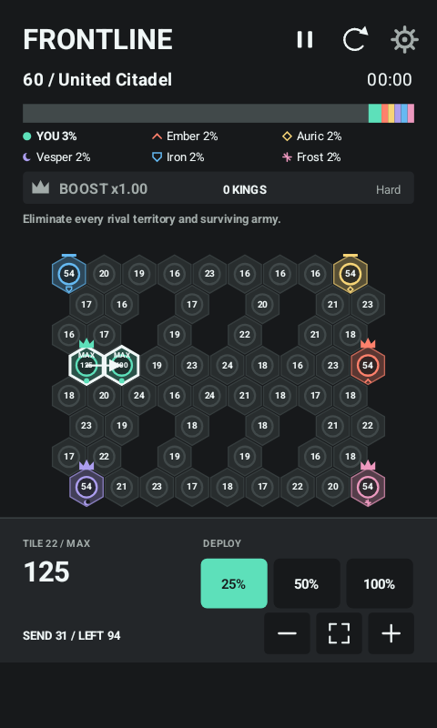
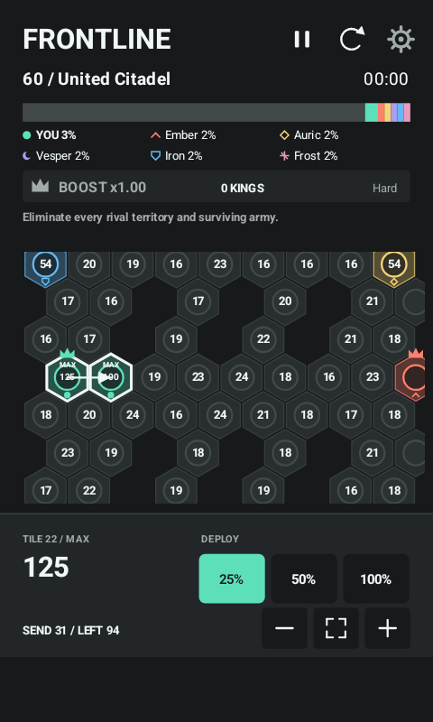
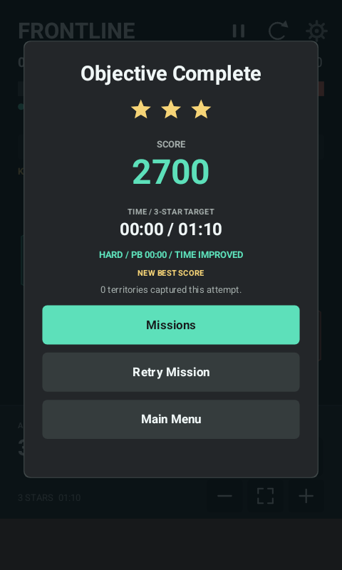
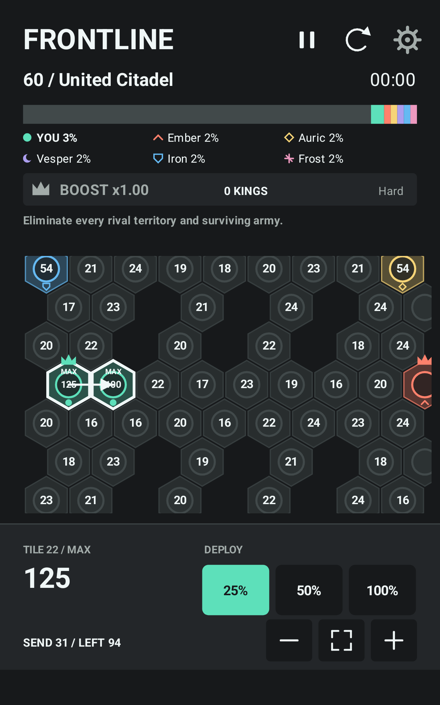

# Native Screenshots

## V10

These are actual Android 15 Canvas captures from the final V10 native harness, not mockups. Small phone: 480x800; tall phone: 720x1600; tablet: 1200x1920. The fixture disables audio, enables opt-in logs and uses the V7 review code. The result fixture shortens the retain-king timer to 0.2 seconds only for repeatable UI verification; it is not evidence of ordinary mission completion time. Dense-map selection fixtures set 125/100 caps to verify MAX and readable selected counts.

| Continue and Protected Attempts | Mission Briefing |
| --- | --- |
|  |  |

| Objective Missions | Offline Daily |
| --- | --- |
|  |  |

| Mastery | Settings and Local Export |
| --- | --- |
|  |  |

| Dense Fit | Dense Zoom |
| --- | --- |
|  |  |

| Result Fixture | Tablet Zoom |
| --- | --- |
|  |  |

Run `scripts/test-android-v10.ps1` after installing the current build on the named test emulator. Its separate instrumentation package is removed afterwards, original preferences and viewport settings are restored, and CSV export is verified through the actual Activity callback and an external content URI. Full captures/CSV fixtures remain under ignored `build/device/v10-native/`. Screenshots cannot establish physical-phone touch accuracy or enjoyment.

## Historical V6

These are actual Android Canvas captures from the Android 15 test emulator, not UI mockups. Most are 720x1280; the small-phone and tablet captures use their labelled viewport sizes. Boost, cap, surrender and campaign-ending captures use deterministic test saves to make the states reproducible.

| Main Menu | Booster Tutorial |
| --- | --- |
|  |  |

| Five Opponents | Persistent Four-King Bonus |
| --- | --- |
|  |  |

| New Story Chapter | Finite Troop Caps |
| --- | --- |
|  |  |

| Rival Surrender | Campaign Complete |
| --- | --- |
|  |  |

| Small Phone (480x800) | Tablet (1200x1920) |
| --- | --- |
|  |  |

Run `scripts/test.ps1` for portable render previews, then `scripts/setup-emulator.ps1`, `scripts/start-test-device.ps1` and `scripts/device-smoke-test.ps1` for native captures under `build/device/`. The smoke test only uses and clears the named `emulator-5580` test device, never a connected physical phone.
