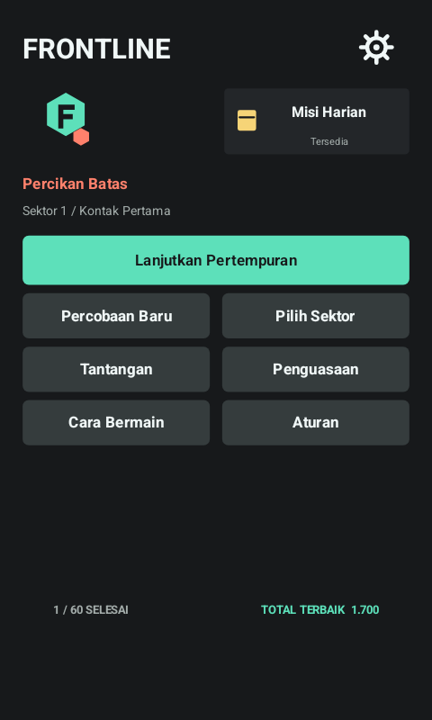
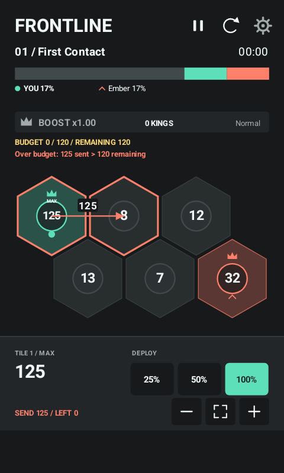
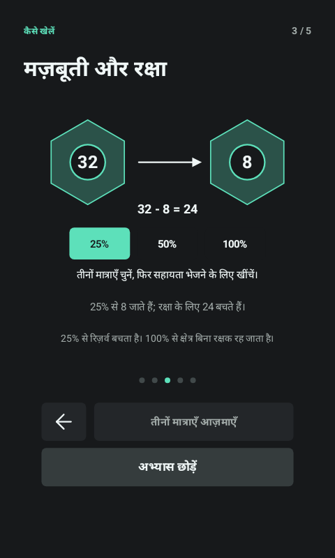

# V11 Phase 1 Verification

Review date: 9 October 2026. This report concerns the V11 working revision, not the historical V10 release. Human playtesting, fluent-speaker review and physical-device testing are pending.

## Scope

| ID | Implementation | Evidence |
| --- | --- | --- |
| P1-03 | Tutorial terminal events are exclusive, guarded and separately cleaned up | Immediate/mid skip, full completion, replay, duplicate input and disabled logging in V11SceneTest |
| P1-04 | Stored terminal reasons; shared integer preview/launch; budget warnings and metrics | Boundary/rounding/reinforcement/invalid-action/cause-save tests in V11ModelTest; native fixture warning/result checks |
| P1-02 | Objective-specific records, independent completion, matching version/difficulty/configuration | V11ProgressTest; FP10 history kept, format-2 ambiguous campaign provenance preserved, format-3 round trips |
| P1-01 | Mission-local Home/Province pressure, equal initial armies | Matched passive and two active-controller results in the defence report; no global combat/production bonus |
| P2-01 | Removed tuning placeholder and raw Daily version from player screens | Challenges/Daily/briefing/results render checks |
| P2-03 | Top-right home gear, native 48 dp target and localized accessible labels | Native foreground fixtures and virtual accessibility nodes |
| P2-05 | Separate Daily entry beneath the gear, no duplicate home action | Native bounds/hit testing, saved date/UTC reset protection |
| P2-04 | Offline English/Indonesian/Hindi, immediate persisted selection | Catalog coverage/placeholder checks and native process-relaunch language checkpoints |
| P2-02 | Current README, architecture and V11 rules updated | Historical V6/V7/V10 reports remain unchanged |

## Portable Commands

```powershell
.\scripts\test.ps1
```

The suite compiles the actual portable model/scene/records and renders the shared scene at compact/tall/tablet sizes. New focused tests exercise integer budget boundaries, explicit terminal precedence, equal armies on all 60 maps/difficulties, exact legacy RNG continuation, frozen map descriptors, record policies/migration and presentation-only language changes.

Passed: 207,263 existing regression checks, 94,219 V11 model checks, 3,001 progress checks, 182 scene checks and 8,794 localization checks. All 457 keys have compatible placeholders in en/id/hi. Portable render checks passed for all 60 maps, ten chapter pages/endings, five tutorial steps and localized mission/menu/settings layouts.

## Balance

The actual model reproduces the supplied V10 training-set passive counts. On the revised Home and Province configurations, Normal and Hard each have 0/20 passive wins in both seeds 0-19 and 1000-1019. Easy and Veiled are reported, not silently excluded. Both active approaches win without state mutation; Province counterattack has a low automated win rate and remains a human-balance question.

See [raw attempts and matched summary](../tools/balance-reports/v11-defense/summary.md). Human enjoyment or difficulty is not inferred from this engineering gate.

## Native Commands

```powershell
.\scripts\build-android.ps1
.\scripts\start-test-device.ps1
.\scripts\test-android-v11.ps1
```

Only the named Android 15 `emulator-5580` is used. The separate instrumentation package backs up/restores local preferences and viewport settings. Reflective result/mission fixtures are marked as fixtures, not human play or organically won battles. Text ink bounds, line/button overlap, Hindi glyph/shaping measurements, density-adjusted targets, localized spoken labels and separate process launches are checked. Screenshots are under `build/device/v11-native/`.

No physical device, fluent-speaker session, frame-rate benchmark or human playtest is claimed.

## Native Outcome

The signed Phase 1 APK passed the complete Android 15 matrix: 23,818 suite checks and 558 separate-process relaunch checks per viewport, at 480x800/240 dpi, 720x1600/320 dpi and 1200x1920/320 dpi (73,128 checks total, plus cleanup). Each suite covers all three languages. Preferences and display overrides were restored and the fixture package removed. FP10 formats 1 and 2 migrated to format 3 without awarding extra rewards.

The native Hindi probe measured 2,457 text-ink pixels and a 4,201-pixel difference from missing-glyph boxes. Android rounds `Paint.measureText` up to a pixel: the shaped advance 219.4336 correctly measured 220.0. The test checks unrounded run/caret agreement and this ceil relationship; it does not equate rounded and unrounded values. This is automated font/layout evidence, not fluent-speaker approval.

Current native fixtures (not human sessions or organically won battles):




